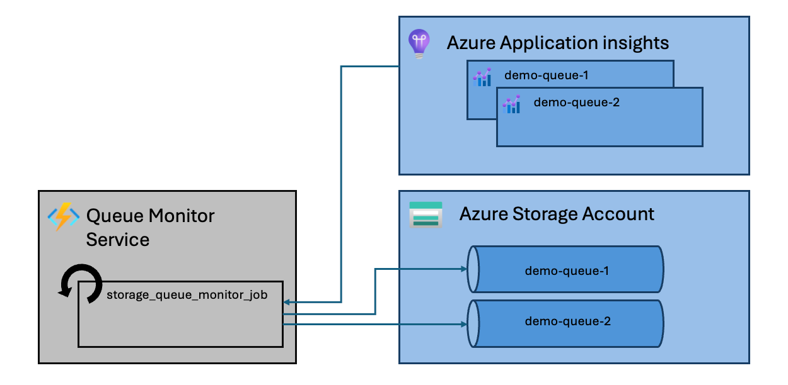
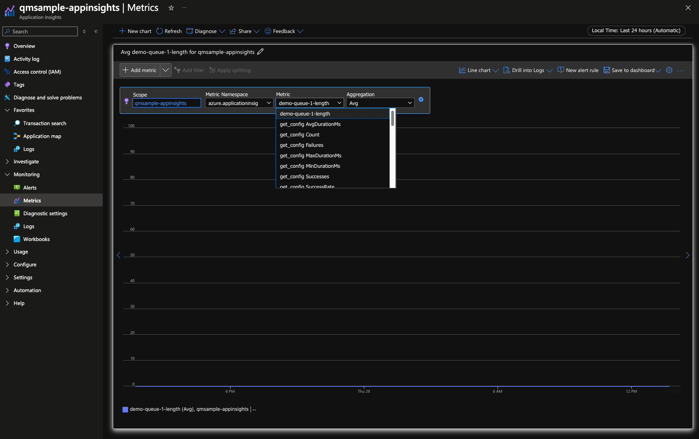
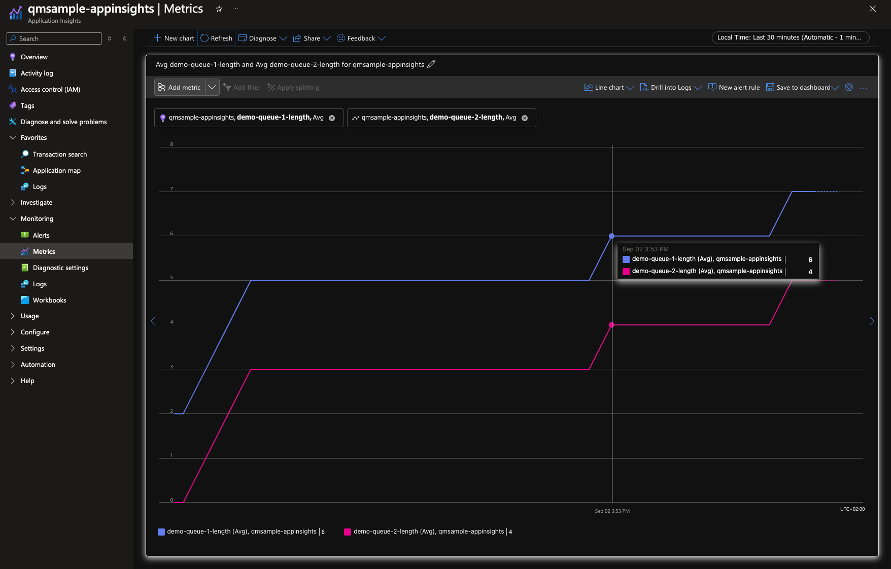

# Monitor Azure Storage Queue Length and Emit Metrics

Have you ever used the [Azure Storage Account Queues](https://learn.microsoft.com/en-us/azure/storage/queues/storage-queues-introduction) and realized that you lack visibility into the number of messages in your individual queues? This can be particularly concerning when you have things like poison queues set up—you definitely want to know if something's in them, right? 🕵🏻‍♀️

Of course, you could explore different tools like [Event Hub](https://learn.microsoft.com/en-gb/azure/event-hubs/) or [Event Grid](https://learn.microsoft.com/en-us/azure/event-grid/), but making a switch like that isn’t always feasible.

**Not to worry—I’ve got a solution for you! 😉**

This repository contains a sample that demonstrates how to use a small service based on [Azure Functions’ Timer Trigger](https://learn.microsoft.com/en-us/azure/azure-functions/functions-bindings-timer?tabs=python-v2%2Cisolated-process%2Cnodejs-v4&pivots=programming-language-python) functionality to create a monitoring solution. ⚡️

 > [!NOTE]
 > What if your architecture already is using a multi-instance Azure Functions? Still not a problem! This approach can live as its own service or within an existing Azure function instance.
 > The Timer Trigger will handle concurrency issues, ensuring that only one instance of your solution will emit the metrics, taking away the complexity for you to have to implement a distributed lock for a simple monitoring solution. 🔒

## What does this sample cover?

- ⚙️ **Configurable Queue Connections:** Monitor a set of queues using either Managed Identity or the Storage Account Key.
- 🏗️ **Scalability:** Integrate seamlessly into solutions that already have a multi-instance Azure Function setup.
- 📜 **Infrastructure as Code:** Full Terraform setup for the case where you only want the monitoring service up and running.
- 🚨 **Alerting:** Illustrates how you can set up alerts based on the newly introduced metrics.

## Design 🎨

The design of this solution is based on the fact that we can query the queue length using the [Azure Storage Account SDK](https://learn.microsoft.com/en-us/python/api/overview/azure/storage?view=azure-python), even though the resource itself does not publish this information as a metric.

In short, we will do the following:

1. Create a gauge for each queue 📏
2. Periodically query each queue for its length 🔄
3. Emit the new length value as a metric measurement to your telemetry sink 📊

Now, regarding the periodic situation, we have multiple options:

One option, if you have a pre-existing single-instance application, is to run the second and third steps above in a background task that will execute periodically or use an asynchronous gauge.

However, in most cases, we deal with services that have multiple instances (for resilience and other reasons... yeah, I know how inconvenient 🙄), which makes this a tad bit trickier. You could have each instance emit metrics, but that would produce a 💩-ton of telemetry data. Alternatively, you could implement a full-blown distributed lock for a simple metric.

Don't get me wrong—I’m the first to emphasize how important telemetry is—but making sure your lock is foolproof might give you more headaches than necessary, especially when there are already solutions out there to help you!

✨ **And this is where [Azure Functions](https://learn.microsoft.com/en-us/azure/azure-functions/) and its [Timer Trigger](https://learn.microsoft.com/en-us/azure/azure-functions/functions-bindings-timer?tabs=python-v2%2Cisolated-process%2Cnodejs-v4&pivots=programming-language-python) come into play!** ✨

Azure Functions are very lightweight, making them a small yet powerful addition to your architecture. If you're already using Azure Functions, even better! Regardless of how many instances of the same function you have running, as long as they all use the same underlying storage account, Azure Functions will ensure that only one of those instances executes the timer trigger. So it's handling the distributed lock for you! No headache, no worries! 😱

Now let's see what the described design looks like visually. The diagram below shows what was explained above if Application Insights is chosen as a telemetry data sink.



Given the sample is using OpenTelemetry as the instrumentation standard, you will also have no issues emitting your telemetry data into a different sink that is not Application Insights (e.g., OTEL Collector, Prometheus, etc.) by simply using a different [exporter](https://github.com/open-telemetry/opentelemetry-python/tree/main/exporter).

Finally, let's head to how to use the sample in the sections below!

## Table of Contents 📑

- [**Prerequisites**](#prerequisites-) 📋
- [**Running Locally**](#running-locally-%EF%B8%8F) 🖥️
- [**Deploy**](#deploy-) 🚀

## Prerequisites 📋

- **[Application Insights](https://learn.microsoft.com/en-us/azure/azure-monitor/app/app-insights-overview) 📊** (either created manually or using the Terraform scripts)
- **[Python 3.11](https://www.python.org/downloads/release/python-3110/) 🐍**
- **[Azurite](https://learn.microsoft.com/en-us/azure/storage/common/storage-use-azurite?tabs=visual-studio%2Cblob-storage) 🚀**
- **[Azure Function Core Tools](https://learn.microsoft.com/en-us/azure/azure-functions/create-first-function-cli-python?tabs=macos%2Cbash%2Cazure-cli%2Cbrowser#install-the-azure-functions-core-tools) ⚒️**
- _[Terraform](https://developer.hashicorp.com/terraform/tutorials/aws-get-started/install-cli) (Optional)_ 🌍

> [!IMPORTANT]  
> This sample leverages [Azure Application Insights](https://learn.microsoft.com/en-us/azure/azure-monitor/app/app-insights-overview) as a sink for your telemetry data as part of the auto-instrumentation with [OpenTelemetry Distro](https://learn.microsoft.com/en-us/azure/azure-monitor/app/opentelemetry-enable?tabs=python). If you need the telemetry data to be sent elsewhere, don't worry! Simply replace the auto-instrumentation part with your own, and add one of the many sinks that OpenTelemetry provides for you 😉

## Running Locally 🖥️

### 1. Set-Up 🛠️

To get you started, there is a handy `Makefile` in the root of this repository! Use its `setup` command, and it will get you going in no time. 🚀

It will do the following things:

1. Create a virtual environment `.venv`
2. Activate said `.venv`
3. Install all dependencies using `poetry`
4. Create the Azurite demo queues called `demo-queue-1` and `demo-queue-2` with the script in `scripts/azurite_setup.py`

To do that, just run the following command from the root of the repository:

> [!IMPORTANT]
> Make sure you have started Azurite up before you do that!

```bash
make setup
```

So now you should be all set to start running the monitor! ✅

### 2. Environment Variables

Let's now configure the monitor correctly before we run it. To do that, copy the `local.settings.sample.json` in the `src/` directory to `local.settings.json`.
Replace the placeholders with your Application Insights connection string. The monitored queue list is already pre-configured to use the `demo-queue-1` and `demo-queue-2` created in the previous step. Unless you want to monitor other queues as well, you can keep that as is for now.

Next, let's get this thing up and running in the next section! ⏩

### 3. Run

Here again, the handy `Makefile` can help us.
By running the command below from the root, the function will start up.

```bash
make start
```

> Under the hood, this will navigate into the `src/` folder and run `func host start --port 7071 --verbose`.

After a short while, you should be able to see custom metrics in your Application Insights, like in the image below:



### 4. Send Test Message

There is now a metric table, but it looks rather empty and lame. To actually see something there, we need to place messages into the queues.
For that, there is a sample script `scripts/send_message.py`, which will publish a few messages in intervals between 1-10 min into our demo queues. 📨
By running another `make` command, we can execute said script.

```bash
make send-message
```

Now, after waiting a while, the message count should be reflected in Application Insights.



How would this whole thing look deployed, you wonder?
In that case, let's look at the next section, which is provisioning the infra and deploying the monitor. 🔍

## Deploy 🚀

If you want to see how the solution will look when deployed, the sample includes the necessary Terraform scripts in the `infra` folder.

What does the infra contain:

- Application Insights 📊
- Azure Container Registry 📦
- Storage Account with queues that will be monitored (`<prefix>-poison-queue` and `<prefix>-queue`) 🗄️
- Azure Function with Monitor Service deployed using a Docker container ⚡️
- Managed Identity role assignment for the Azure Function to access the queues it’s monitoring 🔐
- Alerts for the `<prefix>-poison-queue-length` metric 🚨

So, let's get started! 🌟

### 1. Create Infrastructure 🏗️

Navigate to the `infra` folder and initialize Terraform. Then, plan it with the commands below:

```bash
terraform init
terraform plan
```

This will show you the changes that Terraform will make, in this case, the resources it will create. If the plan looks good, run the following command to apply the changes:

```bash
terraform apply
```

This might take a moment, so feel free to grab a coffee ☕ while you wait. When you return, your environment should be provisioned!

> [!INFORMATION]
> Given that we don’t have a Docker image in the ACR yet, the function will show an error if you visit the resource. Not to worry, as we will resolve this in the next step!

Next, we’ll build the image of our Monitoring Service and push it.

## 2. Build and Push Monitor Service Image 🛠️

To deploy the monitor in this sample, we chose to package the service in a Docker image and push it to the ACR we created in the previous step. There is a `Dockerfile` under `src/` which can be used to build and push the image. To make things easier and reduce configurable variables, the image name in the infra is hardcoded to `storage-queue-monitor`, and the ACR will be called `qmsampleacr` with the default values. Hence, there is already a make command to handle the build and push step.

If you have changed the Terraform variable `var.prefix` or the image name, feel free to adjust the make command or do it manually. Otherwise, use the command below:

```bash
make build-push
```

## 3. Check out your Monitor Service 🎊

If you restart the Azure Function, you should have the monitor ready to run. The metrics should start showing up sooner or later as well.

Also does the service have two helpful endpoints so you can check on its heath and configuration:

- `/api/health/`: A classic health endpoint
- `/api/get_config`: This endpoint will return the configured queues that are monitored

> [!CAUTION]
> `/api/get_config` should be disabled in production as it might contain a storage account key!!

---

Hope that was helpful!
With that, enjoy monitoring 👩🏻‍💻
